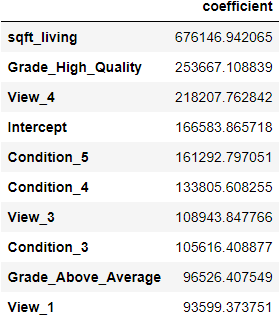

# Overview
The subject for this project is a prospective homebuyer looking to live in King County, Washington for a few years and then sell the house for a profit. The buyer is medium income, interested in purchasing a home under one million dollars, and has a budget for renovation.  Linear regression is used to best predict the price of a house and to determine each attribute's influence on the said price. Data collected on house sales in the area is read into a Jupyter notebook, cleaned, transformed, and modelled to provide an understanding  

## Business Problem
* What is the impact of living in a particular section of King County versus other sections.
* Where is renovation money best spent?
* What is the correlation between the sizes of properties and their selling prices?
***

## Data
   The kc_house_data.csv from Kaggle.com is the source of data for this project and contains 21,597 entries of homes sold in King County, Washington in the years 2014 and 2015.  Features from this dataset include a house's square footage of living space, it's number of bedrooms, and a grade based on it's construction quality. It's 'price' column becomes the target variable.

## Methods
   Initial data cleaning involved removing duplicates and extreme outliers, assigning values to missing data, and changing columns to appropriate data types.  The baseline model trained here does not meet any of linear regression's assumptions.  And so, all categorical variables are turned into indicator columns, some (months, bedrooms, etc.) are first binned to reduce feature numbers.  New predictors are formed applying user created functions to split data based on renovation recency and coordinates.  Another model trained at this point, model two, shows an increased r-squared but still fails to meet the assumptions.  Data preparation for the third model was the removal of outliers in the dataset's 'price' and 'sqft_lot' columns determined with use of the interquartile range.  This model proves to meet the assumptions of both normality and homoscedasticity and yields a r-squared of %69.1.  Finally, for model four both continuous variables were log transformed and scaled to produce more normally distributed features.  This model meets all four assumptions of linear regression and therefore produces a much more reliable r-squared of %68.6.

## Results
   Model 4's coefficients provide many insights into which qualities to consider when purchasing a home and what changes, if any, should be made to increase resale value.

   Grade_High_Quality and Grade_Above_Average show $254K and $97k 
   Our bedroom coefficients suggest there is a negative impact on price when increasing the number of bedrooms.  This is counter intuitive and requires additional investigation 

## Conclusions
   It is suggested homebuyers consider paying for top quality construction and construction materials. 

## Next Steps

   